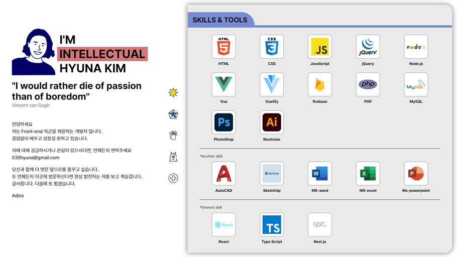
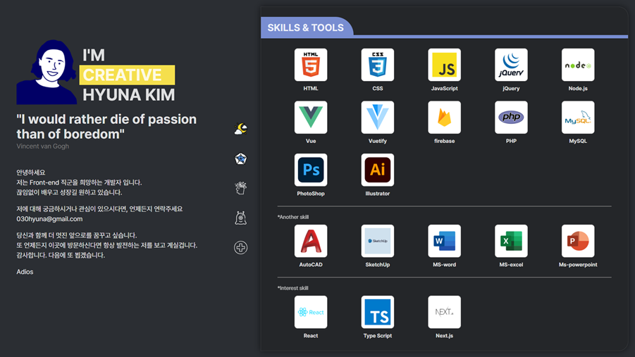

<h1>HEINA-EFFECT Portfolio<h1>

  
  

<!-- <h3>Heina-effect란?</h3>
Heiniffect 란 Heina + effect 의 결합어로 초기값의 미세한 차이에 의해 결과가 완전히 달라지는 나비효과현상과 같은 Heina효과를 말한다. -->

<h5>URL: https://heina-effect.github.io/</h5>

개발목표 : 
  Onepage처럼 보이지만 각자의 카테고리를 생성하여 포토폴리오를 하나의 책자 형식으로 제작였다. 
 페이지는 보유기술, 프로젝트, 이력서, 연락처 및 이메일 전송 페이지로 이루어져 있다.  
 이메일 전송페이지는 <strong>google의 AppsScript</strong>를 사용하였으며,<strong> 다크모드와 라이트모드</strong>를 넣음으로서 눈의 피로도를 줄여 포트폴리오를 자세히 살펴볼 수 있도록하였다.
  
 <h5>사용기술: HTML, CSS, JavaScript, jQuery</h5>
  
  
 개선사항: 

1. 페이지마다 용량이 커서 로딩오류가 발생할 수 있으므로 SPA(Single Page Application) 변경이 필요하다. 
2. 반응형 개선 필요 
3. 프레임워크 및 라이브러리를 활용하여 유지보수 및 관리가 쉽도록 하여야 한다. 
4. 클린코드 및 리팩토링 필요 

